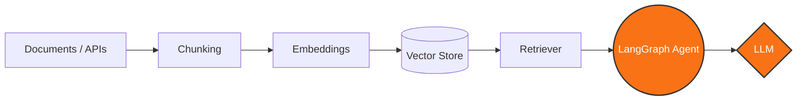
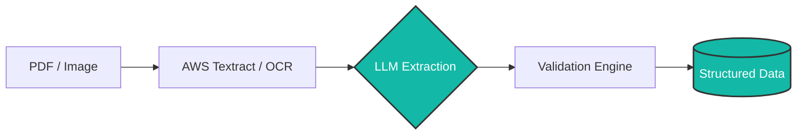
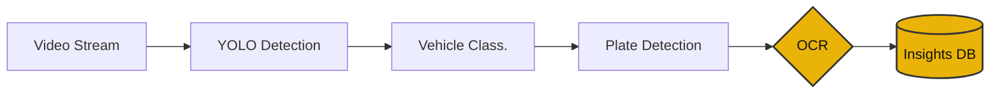

<div align="center">


<br>

[](mailto:sahilwagh.dev@gmail.com)
[](https://kaggle.com/sahilwagh)
[](https://www.leetcode.com/sai_wagh)
[](https://github.com/sahilwagh99)

</div>


## 🎮 `[ PRESS START ] : whoami`

```python
class SahilWagh(Player):
    def __init__(self):
        self.role = "AI & Automation Engineer"
        self.current_level = 99
        self.hp = "100%"
        self.mana = "Infinite Coffee"
        
        self.skill_tree = [
            "Generative AI",
            "RAG Systems",
            "Agentic AI",
            "Intelligent Automation",
            "Computer Vision",
            "Cloud & DevOps"
        ]
        
        self.main_quest = "Automate what should not be manual."
```

## ⚔️ `[ LOADOUT ] : Engineering Stack`
<div align="center">

<table width="100%">
<tr>
<td width="50%" valign="top" align="left">

### 🔮 Magic & Intelligence (AI & GenAI)
*Summoning production-ready language and retrieval models.*<br><br>

<br><br>

</td>
<td width="50%" valign="top" align="left">

### 🛠️ Crafting & Storage (Backend & Data)
*Architecting scalable data pipelines and APIs.*<br><br>

<br><br>

</td>
</tr>
<tr>
<td width="50%" valign="top" align="left">

### 👁️ Perception Buff (Vision & Document AI)
*Extracting structured intelligence from unstructured data.*<br><br>

<br><br>

</td>
<td width="50%" valign="top" align="left">

### ☁️ Base Camp (Cloud & Automation)
*Deploying resilient systems and RPA workflows.*<br><br>

<br><br>

</td>
</tr>
</table>

</div>
## 🗺️ `[ QUEST LOG ] : System Architectures`

### 🧠 RAG & Agentic AI Architecture


### 📄 Intelligent Document Processing


### 🚗 Computer Vision Pipeline


---

## 🕹️ `[ GAMEPLAY LOOP ] : Engineering Mindset`

<div align="center">

`01 UNDERSTAND` ➡️ `02 AUTOMATE` ➡️ **`03 INTELLIGENT`** ➡️ **`04 SCALE`**

*Find the bottleneck → Build the system → Automate the workflow → Scale the solution*

</div>

---

## 🏆 `[ PLAYER STATS ] : Achievements & Logs`

<div align="center">
  
  <br><br>
  
  
  <br><br>
  
</div>

---

<div align="center">


> *"Engineering intelligent systems out of digital chaos."*

**BUILD → AUTOMATE → INTELLIGENT → SCALE**

<br>

[](https://drive.google.com/file/d/1lpU4DsrjAuA8hxiXneTlSdRclogX9dpT/view?usp=sharing)

</div>
