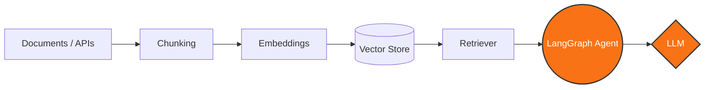
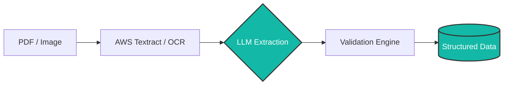
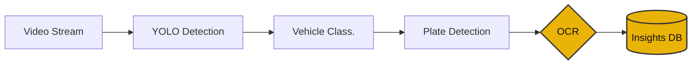

<div align="center">

# ⚡ Sahil Wagh
### `>_ AI & AUTOMATION ENGINEER`

*Building AI-powered automation systems • Engineering RAG & Agentic AI pipelines • Turning unstructured data into intelligence*

[](mailto:sahilwagh.dev@gmail.com)
[](https://kaggle.com/sahilwagh)
[](https://www.leetcode.com/sai_wagh)
[](https://github.com/sahilwagh99)

</div>

---

## 👨‍💻 `whoami`

```python
class SahilWagh:
    
    role = "AI & Automation Engineer"

    focus = [
        "Generative AI",
        "RAG Systems",
        "Agentic AI",
        "Intelligent Automation",
        "Computer Vision",
        "Cloud & DevOps"
    ]

    philosophy = "Automate what should not be manual."
```

---

## 🛠️ Engineering Stack

<table width="100%">
<tr>
<td width="50%" valign="top">

### 🧠 AI & GenAI
*Building production-ready language and retrieval models.*<br>

`LangChain` `LangGraph` `LlamaIndex` `HuggingFace` `RAG` `FAISS` `ChromaDB` `Pinecone` `PyTorch`

</td>
<td width="50%" valign="top">

### 🐍 Backend & Data
*Architecting scalable data pipelines and APIs.*<br>

`Python` `FastAPI` `PostgreSQL` `MongoDB` `MySQL`

</td>
</tr>
<tr>
<td width="50%" valign="top">

### 👁️ Vision & Document AI
*Extracting structured intelligence from unstructured data.*<br>

`YOLO` `OpenCV` `EasyOCR` `PyMuPDF` `Docling` `AWS Textract`

</td>
<td width="50%" valign="top">

### ☁️ Cloud & Automation
*Deploying resilient systems and RPA workflows.*<br>

`AWS` `Docker` `Jenkins` `CI/CD` `UiPath` `Power Automate`

</td>
</tr>
</table>

---

## 🚀 Featured Engineering Pipelines

### 🧠 RAG & Agentic AI Architecture


### 📄 Intelligent Document Processing


### 🚗 Computer Vision Pipeline


---

## 🧩 Engineering Mindset

<div align="center">

`01 UNDERSTAND` ➡️ `02 AUTOMATE` ➡️ **`03 INTELLIGENT`** ➡️ **`04 SCALE`**

*Find the bottleneck → Build the system → Automate the workflow → Scale the solution*

</div>

---

## 📊 GitHub Analytics

<div align="center">
  
  
  <br><br>
  
</div>

---

<div align="center">

> *"Engineering intelligent systems out of digital chaos."*

**BUILD → AUTOMATE → INTELLIGENT → SCALE**

<br>

[](https://drive.google.com/file/d/1lpU4DsrjAuA8hxiXneTlSdRclogX9dpT/view?usp=sharing)

</div>
