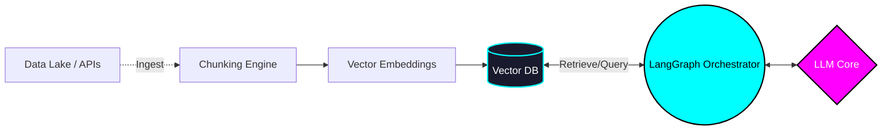
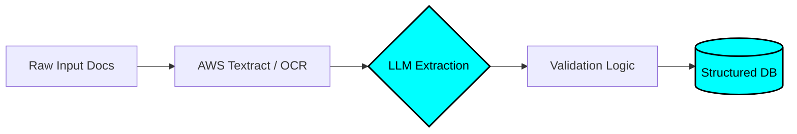

<div align="center">

<!-- Header Banner -->


</div>


<br>

[](mailto:sahilwagh.dev@gmail.com)
[](https://kaggle.com/sahilwagh)
[](https://www.leetcode.com/sai_wagh)
[](https://github.com/sahilwagh99)

</div>

---

## 🤖 `> ./execute_profile.sh`

```python
class SahilWagh(Architect):
    def __init__(self):
        self.title = "AI & Automation Engineer"
        self.status = "Optimizing Reality"
        
        self.core_processors = [
            "Generative AI", 
            "RAG Pipelines",
            "Agentic Swarms", 
            "Intelligent Automation",
            "Computer Vision", 
            "Cloud Orchestration"
        ]
        
        self.directive = "Automate what should not be manual. Scale what matters."
        
    def generate_value(self):
        return "Intelligence extracted from unstructured chaos."
```

## ⚙️ `> SYSTEM_COMPONENTS`

<div align="center">
  <!-- Immersive Background Table -->
  <table width="100%" style="background-color: #0D1117; border: 2px solid #00FFFF; border-radius: 10px; padding: 10px;">
    <tr>
      <td width="50%" align="center" style="border-right: 1px solid #333; border-bottom: 1px solid #333; padding: 20px;">
        <h3 style="color: #00FFFF; font-family: monospace;">🧠 AI / NEURAL NETS</h3>
        <p><i>Building production-ready LLMs & RAGs</i></p>
        
      </td>
      <td width="50%" align="center" style="border-bottom: 1px solid #333; padding: 20px;">
        <h3 style="color: #00FFFF; font-family: monospace;">🌐 CLOUD / DEVOPS</h3>
        <p><i>Deploying resilient systems & architectures</i></p>
        
      </td>
    </tr>
    <tr>
      <td width="50%" align="center" style="border-right: 1px solid #333; padding: 20px;">
        <h3 style="color: #00FFFF; font-family: monospace;">🐍 BACKEND CORE</h3>
        <p><i>Architecting scalable data pipelines & APIs</i></p>
        
      </td>
      <td width="50%" align="center" style="padding: 20px;">
        <h3 style="color: #00FFFF; font-family: monospace;">⚙️ AUTOMATION SUITE</h3>
        <p><i>Extracting data and automating workflows</i></p>
        
      </td>
    </tr>
  </table>
</div>

## 📡 `> ACTIVE_PIPELINES`

<details open>
<summary><b style="font-size: 1.1em; color: #00FFFF;">🟢 RAG & Agentic AI Architecture</b></summary>
<br>


</details>

<details open>
<summary><b style="font-size: 1.1em; color: #00FFFF;">🔵 Intelligent Document Processing</b></summary>
<br>


</details>


<div align="center">

<!-- Tech Data Footer Graphic -->


<br><br>

> *"Engineering intelligent systems out of digital chaos."*

**BUILD → AUTOMATE → INTELLIGENT → SCALE**

<br>

[](https://drive.google.com/file/d/1lpU4DsrjAuA8hxiXneTlSdRclogX9dpT/view?usp=sharing)

</div>
